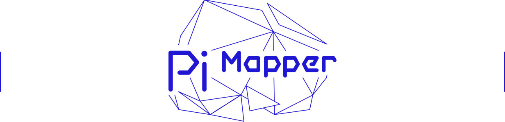

# ofxPiMapper

[](https://gitter.im/kr15h/ofxPiMapper?utm_source=badge&utm_medium=badge&utm_campaign=pr-badge&utm_content=badge)

Projection mapping addon for openFrameworks that runs on the Raspberry Pi.

OfxPiMapper is there for people who want to use the Raspberry Pi to create standalone mapping installations. Let's say someone has 10 generative mapping pieces and gets an offer to exhibit them in an art gallery, museum or any other kind of place. 10 expensive computers? No! OfxPiMapper is here to save you!

The project started as master's thesis project by [Krisjanis Rijnieks](http://rijnieks.lv) at the [Helsinki Media Lab](https://medialab.aalto.fi/). Currently undergoing changes. Expect the API to be incompatible with your projects from the past or present-day.

Consult the [Installation](#installation) section if you are using ofxPiMapper the first time. Some of the most frequently asked questions and answers can be found in the [FAQ](/FAQ.md) document.


## Features

The following is a list of key features ofxPiMapper has.

 - **Open Source**  
   You can use ofxPiMapper free of charge, the only requirement being adding reference to the authors of the project somewhere. Consult the [LICENSE.md](LICENSE.md) file.
 - **Simple User Interface**  
   The user interface of ofxPiMapper has been designed by keeping in mind that there is only one screen, a keyboard and a mouse.
 - **Out of the Box**  
   You can use the example project for simple projection mapping projects with image or video sources out of the box.
 - **Customizable**  
   Use ofxPiMapper as an addon and enjoy the power of custom generative sources by extending the `FboSource` class. 
 - **Undoable**  
   Since version 0.2.3 ofxPiMapper supports undo. 
 - **Nerd Remote Control via SSH (not working at the moment)**
   All the functions can be triggered by using the keyboard and via SSH CLI connection. See [SSH Remote Control](#ssh-remote-control) section to learn more.
 - **More to Come**  
   Expect more conventional projection mapping software features to be implemented.


## Running the Example

You can use the example application of the addon for simple projection mapping projects where static images or videos have to be projection mapped. 

1. Put your own sources in the `example/bin/data/sources` directory. Consult the [ofxOMXPlayer](https://github.com/jvcleave/ofxOMXPlayer) documentation on how to encode your videos.

2. Compile and run the example project.  

   ```bash
cd openFrameworks/addons/ofxPiMapper/example
make && ./bin/example
   ```

3. Use the `-f` flag to launch it fullscreen.  

   ```bash
./bin/example -f
   ```


## Compiling on Linux

There might be issues with compiling because `ofxOMXPlayer` and `ofxRPiCameraVideoGrabber` addons do not exist on Linux and also other non-RPi platforms. To avoid the issues, do the following.

1. Open `example/addons.make` and remove ofxOMXPlayer line.
2. Open `example-camera/addons.make` and remove ofxRPiCameraVideoGrabber line.
3. Compile one or both examples by using make.


## Using as an Addon

OfxPiMapper features FBO sources that allow you to create generative openFrameworks patches to be used with ofxPiMapper. Extend the `FboSource` class, override `setup()`, `update()` and `draw()` methods and then create an instance of your custom source to add it to your ofxPiMapper object.

Reuse the `example` app by copying it to your `apps` directory.

```bash
cp -R openFrameworks/addons/ofxPiMapper/example openFrameworks/apps/myApps/
cd openFrameworks/apps/myApps
mv example myOfxPiMapperApp
```


## Development

The most part of development happens in the `dev` branch. Once a set of features is added, the `dev` branch is merged with the `master` branch. 

 1. Develop in the `dev` branch.
 2. Merge the `dev` branch into the `master` branch once a set of features are added.
 3. Add a version tag.
 4. If there is a need for a quickfix, it can be added to the `master` branch directly. In that case a new version tag has to be made.

The set of features is defined per milestone. Each milestone is an increase in the minor part of the version number. Milestone examples: 0.3.0, 0.4.0, etc.

The quickfixes increase the patch part of the version. 0.3.0 becomes 0.3.1 and 0.4.0 becomes 0.4.1 in the case of a quicfix.


## Licence

ofxPiMapper is distributed under the [MIT License](https://en.wikipedia.org/wiki/MIT_License). See the [LICENSE](LICENSE.md) file for further details.


## Installation

To set up your Raspberry Pi, go to the [Raspberry Pi website](http://www.raspberrypi.org/downloads/) and follow the instructions there.

Another thing you need is a working [openFrameworks](http://openframeworks.cc) installation. Follow the guide to set up your Raspberry Pi.
 
 - [Raspberry Pi oF Setup Guide](http://openframeworks.cc/setup/raspberrypi/Raspberry-Pi-Getting-Started.html)

Clone this (the ofxPiMapper) repository into your `openFrameworks/addons` folder. If your openFrameworks installation on the Pi resides in the home directory, you have to type the following in the terminal:

```bash
cd ~/openFrameworks/addons
git clone https://github.com/kr15h/ofxPiMapper.git
```


## Dependencies

Before moving on, make sure that you have all the dependencies installed. 

 - ofxGui (available in oF by default)
 - ofxXmlSettings (available in oF by default)
 - [ofxIO](https://github.com/bakercp/ofxIO)
 - [ofxOMXPlayer](https://github.com/jvcleave/ofxOMXPlayer)

To install dependencies, `cd` into `openFrameworks/addons` directory and execute the following:

```bash
git clone https://github.com/jvcleave/ofxOMXPlayer.git && git clone https://github.com/bakercp/ofxIO.git
```

The `ofxOMXPlayer` addon recommends you to use its releases. Currently the latest release is `0.9.0-compatible`. To checkout the code of the relase, go to the `ofxOMXPlayer` addon directory and checkout the relase.

```
cd openFrameworks/addons/ofxOMXPlayer
git checkout 0.9.0-compatible
```

You can check the latest releases on the [ofxOMXPlayer GitHub repository](https://github.com/jvcleave/ofxOMXPlayer/releases).


## First Test

To test the addon, you will have to compile and run it:

```bash
cd ~/openFrameworks/addons/ofxPiMapper/example
make && make run
```

After it compiles, run it with either `make run` or `./bin/example`. You can exit the application by pressing `ESC` or `Ctrl + C`.

It will take a while first (not so long on the RPi 2), but once it runs, press 1, 2, 3 and 4 keys to switch between modes of the software. Switch to mode 3 at first to select a surface. Afterwards you will be able to edit the texture mapping of it in mode 2 and choose a source in mode 4. Mode 1 is the presentation mode. It is activated on start by default.


## Usage

Right now a keyboard and a mouse has to be used in order to do the mapping with ofxPiMapper.

### Modes

PiMapper has 4 modes:

1. Presentation mode
2. Texture mapping mode
3. Surface editing mode
4. Source assignment mode

You can access these modes by pressing 1, 2, 3 or 4 respectively.

#### Presentation mode

This mode is activated once the application starts up. It does not show anything else except the final projection mapping as it was saved previously.

#### Texture mapping mode

In this mode you can adjust the texture coordinates of the surface you have selected in the surface editing mode.

#### Surface editing mode

Here you can select, move and distort the surfaces you have created.

#### Source assignment mode

After you select a surface in surface editing mode, activate this mode to be able to choose a source for the surface. Afterwards you might want to go to the texture mapping mode to adjust texture coordinates.

### Other shortcuts

These other shortcuts that you can use while using the example app. 

Key | Function
:--- | :---
1 | Presentation mode
2 | Texture editing mode
3 | Projection mapping mode, use this to select a surface first
4 | Source selection mode
i | Show info
t | Add triangle surface
q | Add quad surface
g | Add grid warp surface
d | duplicate surface
+ | Scale surface up
- | Scale surface down
p | toggle perspective warping (quad surfaces only)
] | add columns to grid surface (grid warp surfaces only)
[ | remove columns from grid surface (grid warp surfaces only)
} | add rows to grid surface (grid warp surfaces only)
{ | remove rows from grid surface (grid warp surfaces only)
. | select next surface (projection mapping mode only)
, | select previous surface (projection mapping mode only)
> | select next vertex
< | select previous vertex
0 | Move selected surface one layer up
9 | Move selected surface one layer down
f | Toggle fullscreen
s | Save composition
z | Undo
BACKSPACE ('\' via SSH) | Delete surface.
SPACE | Toggle pause for video sources (texture and projection mapping modes)
TAB | Select next source (no need to use the source selection interface)
Arrow keys | Move selection. If no surface is selected in the projection mapping mode, all surfaces are moved.

### SSH Remote Control

You can enter a SSH session with your networked Raspberry Pi, launch the ofxPiMapper executable and access all the functionality by using the keyboard. Use the same commands listed in the above table, use `/` as the replacement for the `SHIFT` key as it is not that easy to capture `SHIFT` keypress when on SSH. The `/` works as a toggle, you have to press it once to simulate `SHIFT_DOWN` and one more time to simulate `SHIFT_UP`. It is particularly important when moving surfaces and vertices over long distances. The `/` key enables 10px steps when pressing arrow buttons.

## Compatibility

Tested with openFrameworks 0.9.2 (OS X and Raspbian Jessie Lite). It works.

```
TODO: Add a matrix with oF versions and OS's ofxPiMapper is tested on.
```
